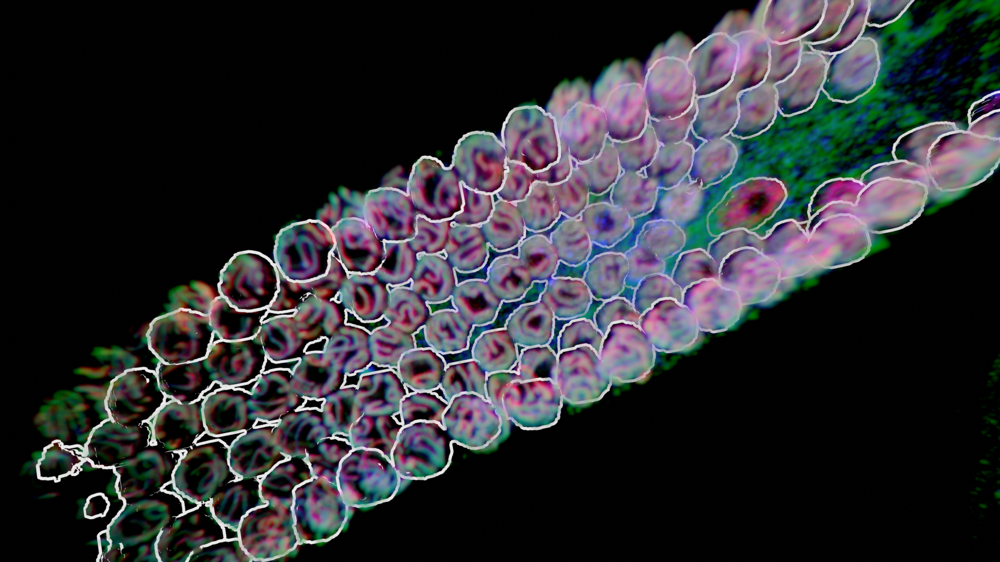

# Blender for Biologists

Hi! This is a course on blender, an open-source 3D modeling software, for biological visualization. This is created initially for the 2023 EMBL Predoc Course but will stay online afterwards, as resources on microscopy data visualization in blender seem sparse on the web. 

The development of the supporting add-on has moved to [a separate repo](https://github.com/oanegros/tif2bpy) as it outgrew the scope of this course. 

**Epilepsy warning! Rendering volumes in Blender can cause flashing lights.**

### Why render microscopy data in blender

All biological systems live in 3D, and a lot of our data, such as microscopy, are also 3D. Most of this is either viewed purely slice-by-slice or in proprietary software. 

Here, I hope to show that we can use the open source software blender, which has a lot of community support from artists, to create pretty and granularly controllable 3D data visualizations.

Let's try to make some pretty microscopy images! 

 

## This workshop

This workshop will hopefully show you:
- loading in 3D microscopy data, and rendering it in Blender
- emulating render modes of popular proprietary visualization software

This will not teach:
- Many blender basics you will not primarily need when using blender as a 3D data visualization tool (sculpting, modeling)

## Structure

The course consists of lessons in .md text files. 

Lesson 0 **Start**:
- [0a Installing blender and zstacker](./lessons/0a_Installing_blender_and_zstacker.md)
- [0b Loading 3D data](./lessons/0b_loading%203D%20data.md)

Lesson 1 **Rendering**: 
- [1a A fast interactive render mode](./lessons/1a_eevee_emission.md)
- [1b A slow pretty volume render](./lessons/1b_cycles_emission_plus_density.md)
- [1c Multichannel rendering](./lessons/1c_multichannel.ms)
- [1d Volume to mesh](./lessons/1d_volume_to_mesh.md)

Lesson 2 **Combining it**:
- [Multichannel images](./lessons/2_multichannel.md)

Extra useful things
- [pdb files with molecular nodes](./extra_lessons/molecular_nodes.md)
- [Rendering on clusters (and tips for the EMBL cluster)](./extra_lessons/cluster_rendering.md)

---

 This work is licensed under a <a rel="license" href="http://creativecommons.org/licenses/by/4.0/">Creative Commons Attribution 4.0 International License</a>.
