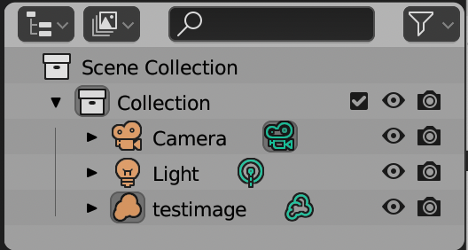
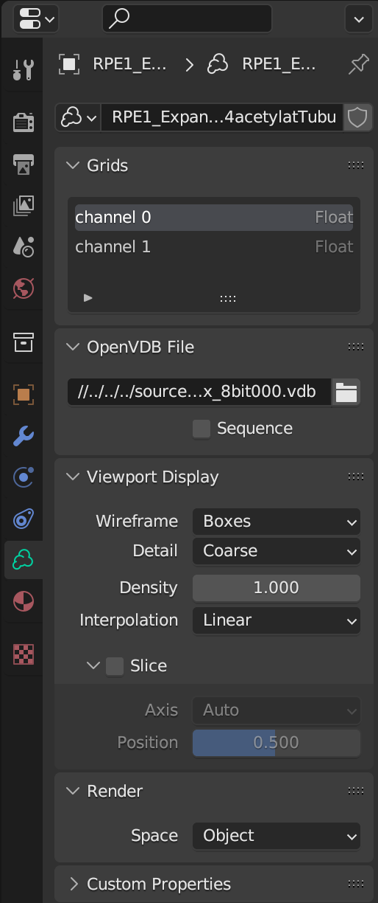

# Rendering: Interactive data exploration 

So currently we have a grey box of loaded in volume data, where blender is not reading out the intensities of the volume. The next goal is to add a `Material` that makes our fluorescence intensity values emit light based on the underlying data!

---

For this we first need to see how the values are stored within the volume:

Go to the `Shading` tab, as we will now change the shading (the interaction of an object with light) of the volume. 

Select the volume in the `Outliner` window.

To show the different channels in the volume we can look at the `Object Data Properties` under the Volume icon in the right `Properties` tab:

Here we have case-sensitive names of all the channels of fluorescence in our data. 

## Volume shaders

To change how the volume interacts with light, we need to assign it a new `Material`. Within the `Material` we can read out the volume data and tell this to either absorb or emit light. 

For this we can `Add a new material`:

This should open up the `Shader Nodes`, a limited graphical programming language in which you can define how a blender object interacts with light:

The `Principled Volume` node contains most of the capabilities of volume shaders in blender, where key parts are `Emission`, how much light each voxel emits, and `Density`, how much light a voxel absorbs.

We can now add new nodes with the options under `Add`, and connect nodes. Anythin that leads to the eventual `Material Output` node, is taken into account when rendering. 

This is an example of a simple shader for microscopy data, where the data emits white light, that you can try to recreate:

Consider how each of the values changes the rendering!

Explanation of how this shader works
 Here the <code>Attribute</code> reads out the <code>channelB</code> intensities in the volume. The <code>Fac</code> output of the <code>Attribute</code> node gives single values per voxel. 
The <code>channelB</code> is then piped into <code>Map Range</code>, which thresholds (here at  >0.1 - very dependent on your data!) and rescales the intensity. 
This goes to <code>Emission strength</code> - the emission of each voxel is defined by the rescaled intensity in the Blue channel. In the <code>Principled Volume</code>, the <code>Density</code> is set to 0. In this way, there is no obstruction for the emitted light. 
The <code>Principled Volume</code> shader is then piped to <code>Material Output</code>. 

<code>Map Range > Clamp</code> explanation
 Clamping values in blender means to restrict to values between 0 and 1 

\
Test out what happens when the `Density` is also defined by the intensity!

## Necessary render settings

We are currently looking only at the `Viewport`, the interactive renderer. We can also set up a camera and make a full `Render`, but this will be discussed in [lesson 1b](./1b_cycles_emission_plus_density.md). However, if you followed the tutorial up til now, the `Viewport` still doesnt look pretty or accurate, so here some recommended settings for interactive viewing.

Viewport Rendering:

 
There are four viewport render modes, and only the `Material preview` and `Rendered` view (the two most on the right) take the shader nodes into account. `Rendered` shading is slowest, but takes all settings into account. 

Try out how these other render settings look! Consider adding a sphere or cube with `Add` or `Shift+A` to see how meshes are rendered in each mode.

Background:

 
You can change the background color in `Rendered` view under the `World Properties` tab. Here a full black is useful for emitting microscopy data. 

Try to see if you can make a shader combination that works with a white background!

Render Properties:

Under `Render Properties` we can change how accurate the render is. We are currently using the `Eevee` render engine, which is a fast and interactive renderer. Here one easy optimization is to increase the number of `Viewport Samples`, increasing the pixel density that is separately sampled.
Additionally, we can change settings in the `Volumetrics` tab: here recommended is to at least go to 2 px `Tile Size`. Here the `Samples` are less straight forward, as they are also modulated by `Distribution`. Often the standard settings work. 

Additionally change under `Render Properties > Color Management` the `View Transform` to `Standard`, the standard `Filmic` color management setting quenches your dynamic range.

\
For more publication-ready render settings go to [lesson 1b](./1b_cycles_emission_plus_density.md)
Or go [back to main](../README.md)