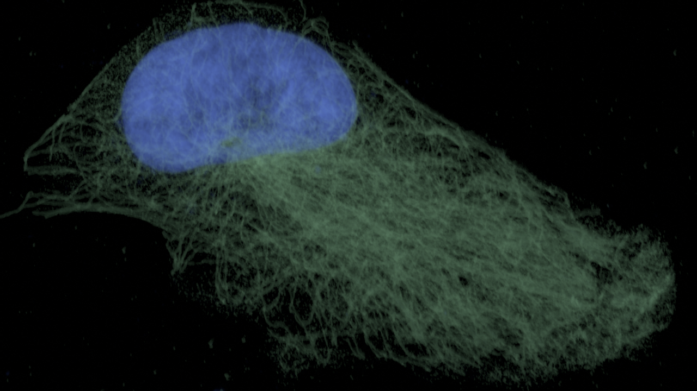
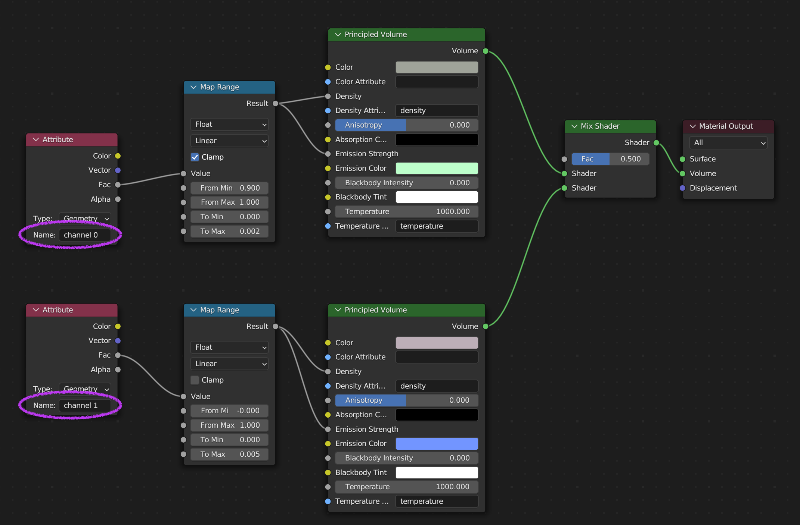

# Multichannel

So far we've only displayed one of the channels of our dataset.
In microscopy data, multiple channels often contain complementary information, highlighting different structures.
Our [example data](../data/RPE1_Expansion_MeOH_405DAPI_488alphabetaTubulin_594acetylatTubulin_647NHS_zstack_40x_8bit.tif.zip) contains stained microtubules in the first channel, and the stained nucleus in the second one.

The approach to showing a second channel builds on our shader from [lesson 1a](./1a_eevee_emission.md):

Modify the _material_ to also show the second channel of the data, maybe in a different color.

The result could look something like this:

<symmary>Hints for showing the second channel.</symmary>

In the above shader pipeline, you've set things up for a single channel.
For a second channel, you can duplicate most of the nodes, but note, that there can only be a single Material Output Node for a Material.
This means that you'll have to find a node that helps you combine two shaders.

Final material:

---

Until now we've been rendering the data as a volume, we can also convert the volume to a mesh to render it as a surface. To learn this go to [lesson 1d](./1d_volume_to_mesh.md). Or [go back to main](../README.md)
