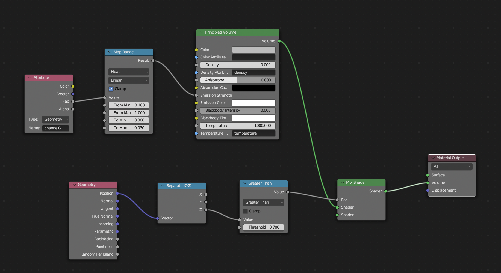

# Combining everything!

With these basics, there is already a lot possible, but way more to still explore, especially with the help of youtube tutorials.

The way to now explore will depend a lot on your data and what you use blender for. To try to show how you can combine features into a bigger file, and try to find render modes that work for your data, here a more complicated project :D. 

With the [microscopy data](../data/gonad2_rgb-2.tif.zip) and [cellpose mask](../data/gonad_masks_rgb-2.tif.zip), try to recreate this render:

 

This shows the _C. elegans_ gonad in the process of meiosis. Here we find homologous chromosomes assembled into the synaptonemal complex, with two axes and a central region. Thus we get colocalizing signal for DNA (DAPI, channelR), the synaptonemal complex Axis (Htp3, channelG) and the synaptonemal complex Central Region (SYP-2, channelB).
- 

About the example data
 xy_scale is 0.0846 µm, z_scale is 0.2 µm. See also <a href="../data/materials_methods_celegans.md">full materials and methods</a>. The data was contributed by Ana Neves. 

As an extra challenge, this also shows the result of a cellpose segmentation pipeline as outlines around the segmented nuclei. Note that outlines are possible in `Cycles`, but easier in `Eevee`. This render was also made with only `Eevee`.

Also, consider animating your output! You can do this by adding `keyframes` for almost all values. An easy way to get started with this is to set a `keyframe` for a camera `Rotation` and `Location` at the start, move the timepoint in the `Timeline`, move the camera and add a new `keyframe` for camera `Rotation` and `Location` at this timepoint. Blender will now interpolate between the two locations at all timeframes in between.

---

Hints for multichannel images
 The <code>Mix Shader</code> Node allows you to combine multiple shaders together before piping to <code>Material Output</code>, for volumetric mixing. 

You've already learned how to do multichannel volume rendering in [lesson 1c](./1c_multichannel.md).
If you want to combine multiple channels rendered as volume to mesh, you need a separate `Geometry`(Cube) for each channel, as the `Mesh to Volume` modifier only thresholds one channel. 

Hints for mask renders
 Outlines are not very easy to make, other render modes may work easier, such as very transparent or translucent materials. 
For transparency to work in <code>Eevee</code>, you need to set <code>Material Properties > Settings > Blend Mode</code> to <code>Alpha Blend</code>.
  
To make outlines work, <a href="https://www.youtube.com/watch?v=5wu_SvCCX_U">i followed this youtube tutorial</a>, where you add a solidify modifier to the volume-to-mesh of the masks. This adds a thickness to the mask. You can then give the original shape a transparent Material and the mask an emmission/other Material. 
Note that for this to work you need to flip the normals of the <code>Solidify Modifier</code> so that <code>Backface Culling</code> in <code>Material Properties > Settings</code> effectively becomes front-face culling (<code>Eevee</code> only tries to render the back of the object). 
  
An even more advanced render may take the value out of the mask and seed a random number generator in <code>Geometry Nodes</code> to assign random colors to each outline. (or even create <code>Instances</code> of each separate nucleus that behave as their own <code>Geometry</code>)
 

 

Hints for slicing
 With the <code>Mix Shader</code> Node, mixing your eventual shader with a <code>Transparent BSDF</code> shader (or even no shader), conditionally based on <code>Position</code> in the volume, you can make volume slicing possible:

 

---

This is the end of the tutorial :D. [Go back to main](../README.md)